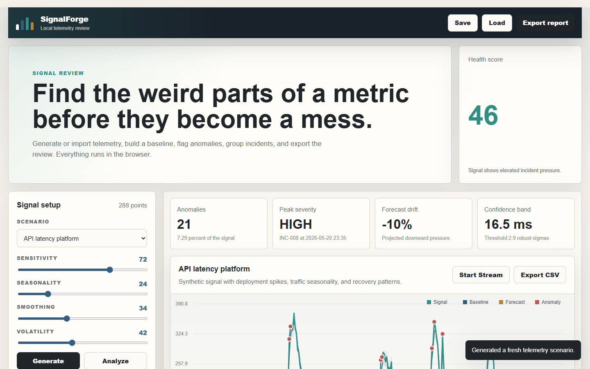

<!-- portfolio:start -->
<p align="center">
  
</p>

<h1 align="center">SignalForge AI</h1>

<p align="center"><strong>Offline telemetry intelligence for anomaly detection and incident review.</strong></p>

<p align="center">

  
  
</p>

## Signal Room

A monitoring interface with the feel of a local incident desk: readings, spikes, and review signals.

## Useful For

Explaining telemetry problems, reviewing anomalies, and showing how AI-style logic can support operational decisions.

## Run Locally

`npm install` then `npm run dev`, or open the static page when no build step is needed.

## Portfolio Note

This repository has its own visual identity inside the portfolio. The goal is that every project feels like a different product, not another copy of the same template.
<!-- portfolio:end -->

---

## Existing Project Notes

# SignalForge

SignalForge is an offline anomaly detection lab for technical telemetry. It generates realistic time-series data, analyzes it with robust statistical models, groups anomalies into incidents, explains likely root causes, and exports investigation reports without requiring a backend or cloud service.



## Why It Matters

Modern systems produce constant streams of metrics: latency, revenue, GPU utilization, power demand, error rates, throughput, and many more. SignalForge gives teams a focused interface to understand whether a signal is healthy, what changed, and which moments deserve investigation.

## Features

- Synthetic telemetry generator with multiple operational scenarios.
- CSV import for custom time-series data.
- Robust anomaly detection using median absolute deviation and adaptive baselines.
- Seasonal baseline blending, smoothing, confidence bands, and forecast projection.
- Incident grouping with severity, duration, impact score, and probable cause.
- Interactive canvas chart with anomaly markers and hover inspection.
- Streaming simulator to replay a signal as if it were arriving live.
- Report export as JSON and CSV.
- Saved workspaces in local storage.
- No build step, no external dependencies, no backend required.

## Project Structure

```text
signalforge-ai/
  index.html
  src/
    app.js
    styles.css
  package.json
  README.md
```

## Run Locally

```bash
npm start
```

Open:

```text
http://localhost:5173
```

You can also open `index.html` directly in a browser.

## CSV Format

Paste or upload a CSV with either one numeric column or two columns:

```csv
timestamp,value
2026-05-20 09:00,120
2026-05-20 09:05,132
2026-05-20 09:10,175
```

If timestamps are omitted, SignalForge creates a sequential time axis.

## Analysis Model

SignalForge uses a local statistical pipeline:

1. Normalize and clean the signal.
2. Estimate trend with exponential smoothing.
3. Build a seasonal baseline from repeated windows.
4. Blend smoothed and seasonal baselines.
5. Score residuals with median absolute deviation.
6. Mark anomalies from adaptive sensitivity thresholds.
7. Merge nearby anomalies into incidents.
8. Forecast the next horizon from recent trend and seasonality.

The result is fast, transparent, and fully inspectable in the browser.

## Author

Alfredo Oliva
